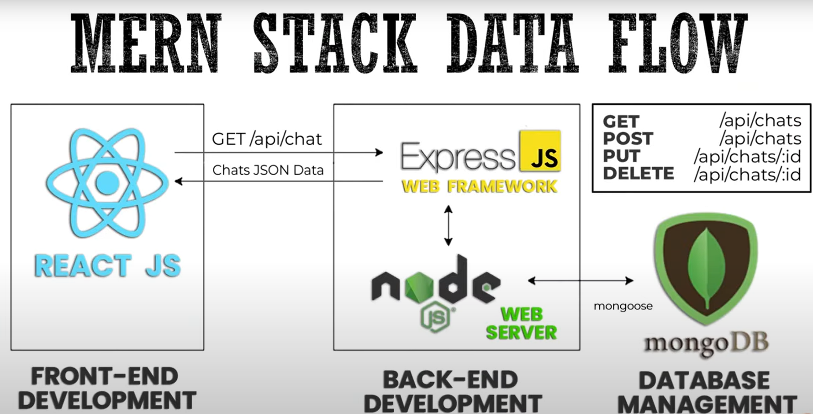

# MERN Stack Overview

- [Introduction](#introduction)
- [React.js](#reactjs)
- [Node.js](#nodejs)
- [Express.js](#expressjs)
- [MongoDB](#mongodb)
- [MERN Stack Diagram](#mern-stack-diagram)
- [Getting Started](#getting-started)

## Introduction

The MERN Stack is a combination of technologies used for building web applications. It includes:

- **MongoDB**: Database management system.
- **Express.js**: Web framework for building backend applications.
- **React**: Frontend library for building user interfaces.
- **Node.js**: JavaScript runtime for server-side development.

For a comprehensive explanation of the MERN Stack, you can visit the [MERN Stack Documentation](https://www.mongodb.com/mern-stack).

## React.js

React.js is a frontend library developed by Facebook. It offers:

- Reusable components.
- Efficient rendering with the Virtual DOM.
- Exceptional performance.

Explore the [React.js Documentation](https://react.dev/) for more information.

## Node.js

Node.js is a JavaScript runtime built on Chrome's V8 engine. It's great for:

- Scalable web servers.
- Real-time systems development.
- Utilizing the Node Package Manager (npm).

Learn more from the [Node.js Documentation](https://nodejs.org/en/docs).

## Express.js

Express.js is a web framework for Node.js, offering:

- Powerful routing API.
- High performance.
- Abundance of third-party plugins.

Explore the [Express.js Documentation](https://expressjs.com/) for detailed information.

## MongoDB

MongoDB is a cross-platform NoSQL and document-oriented database with:

- High scalability.
- Flexible schema.
- Always-on availability.

Understand the differences between [SQL and NoSQL](https://www.mongodb.com/nosql-explained/nosql-vs-sql).

## MERN Stack Diagram

## Steps taken

I tried to document every step of this project , I hope i did not miss anything but it is quite possible.
I tried to leave links to useful websites and put detailed explanation of the steps I've taken to complete this project.
If I missed something , feel free to add or correct by contributing.

| Guide                                                                                                    | Description                            |
| -------------------------------------------------------------------------------------------------------- | -------------------------------------- |
| [1.Set up Environment](./README/SetupEnvironment.md)                                                     | Configure your development environment |
| [2.Creating a Node Server](./README/creating%20Node%20server.md)                                         | Set up a Node.js server                |
| [3.Creating Frontend.md](./README/creating%20Frontend.md)                                                | Create the frontend using React        |
| [4.Building SignUp Client side](./README/BuildingSignUp.md)                                              | Build the sign-up functionality        |
| [5.Building Login Client side](./README/BuildingLogin.md)                                                | Implement the login functionality      |
| [6.Creating DB connection](./README/creating%20DB.md)                                                    | Establish a connection to the database |
| [7.User Authentication and Error Handling](./README/UserAuthentication.md)                               | Secure user authentication             |
| [8.Creating Functionality for Sign Up Client side](./README/CreatingFunctionalityForSignUpClientSide.md) | Enhance the sign-up functionality      |
| [9.Creating Search User and Create Chat](/README/workingOnSearchUserAndCreateChat.md)                    | Search User and Create Chat            |

## I hope these guides will help you step-by-step in setting up your MERN Stack project, building user authentication, and handling errors efficiently.

### Project Management Tool Used is Azure Boards

If you want to check it out [Cick Here](https://dev.azure.com/farhadibrahimov/CHAT%20APP)
